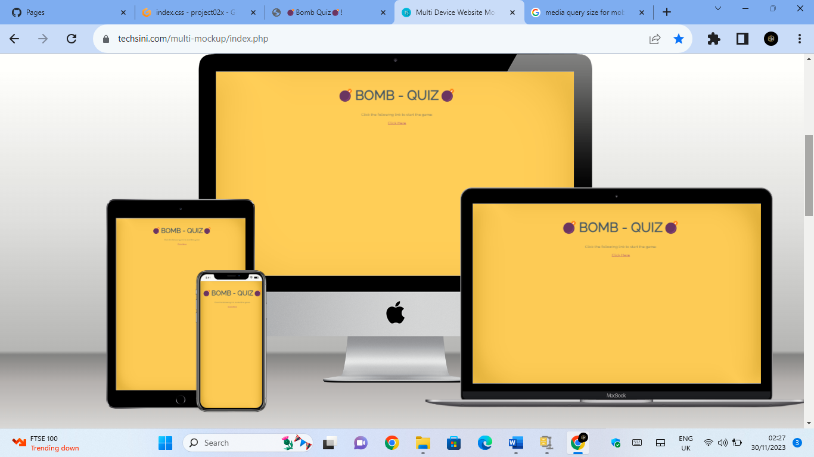
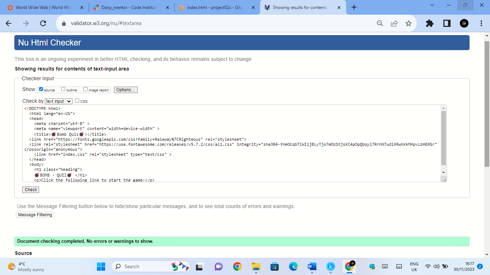
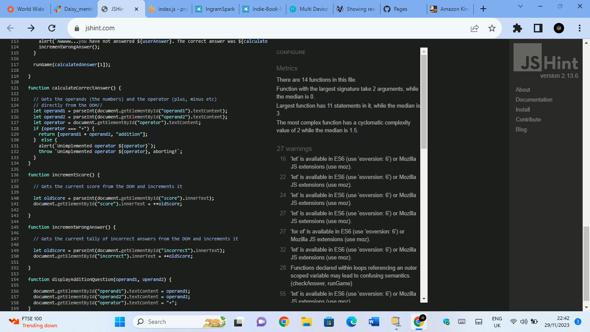

# BOMB QUIZ

(images/mokup1.png)

[View the live project here.](https://infouktour3.github.io/project02x/)

This is the main Bomb Quiz website. It is designed to be responsibe on a range of devices, making it easy and intuitive to understand the use of the game for the reader and visitors.

## User Experience (UX)

### User stories
Looked into Balsamiq to have an idea and after I have carried on the prject with word file converted in pjg image/
[image](images/Wireframe.png)[docs](docs/WIREFRAME WEBSITE.docx)

#### First Time Visitor Goals
1) The website is made in a very clear and easy way to understand the game with a great background colour to show the other function of the game in a fast and intuitive way
2) The User will be able to easily explore the page and read the number result at the botton answers marked to play the game throughout the site. 
3) The visitor can decide when to start to play and when restart a game again just pressing the uperlink words.

##### Returning Visitor Goals
1) Returning Visitor wants to find a good game to be entertained something that keep their attention and excitment high which in return the site is made to enjoy the final user.
2) Returning Visitor like to see something simple and understand the game at the first glance, 
they do not want to be bored on understanding how work the game otherwise they will give up and it helps the visitor to return again.
3) The game is made with a great graphic and good contrast colour help to enjoy the user moment at the same time to make retun them.

#### Frequent User Goals / design colour scheme
1) The user want something fun and colourful with some images that help to get to know the game without reading long information.
2) The predominate colour is a dark yellow background colour with a great contrast with the title colour and the bottoms indication in which passing the cursor on make it change the colour 
 with a great effect and intuition that the bottom which is clickable.
3) In turn make the site more attractive expacially with fonts images showed on the screen.
 
#### Typography
The font used on the website is a Raleway - Sans Serif  as it is one of the most common font used today the font is cleaned is shows good read letters for all reader, 
even when the web site is used with different devices.

#### Imagery
The first image is posted just straight at the top of the page with the title name of the game to catch the visitors attention and transmit to keep user attention.

[image](images/Screenshot website.png)

#### Wireframes
-Home Page with Second Page once clicked Wireframe - [View](images/Wireframe.png)

#### Features
The website has an actractive approach for the user, 
easy to understand and very intuitive with images and iconas to driver the visitor attention and clearly help to understand the business without that the user gets lost, 
the first page contain the link interactive clickable to pass to a new  page where they can start to play.
The game  page also is comprensive of box and bottoms  and with an indicator answer underneath of the bottoms to make more appeal to the visitor whcih they want to test themself. 
At the srat of the game, wil appear the countdown where the user will have a limited time to answer the right question, the two text written under the bottome give to them an indication if they have answered correctly, gathering and showing number on the right or wrong answer, it help to facilitate the user their progress. 
The website has also the features to be responsive on all device sizes and contain interactive elements like hyperlinks and bottoms.

### Technologies Used
Laptop

### Languages Used
HTML5
CSS3
JS

#### Frameworks, Libraries & Programs Used
1) [Bootstrap v5.3] (https://getbootstrap.com/)
Bootstrap has been visited to assist me with the idea to create a responsiveness webssite and it help me a bit but I used at the end a word file. 
[Frameworks] (https://infouktour3-project02x-w7gubda7n57.ws-eu106.gitpod.io/)

2) [Hover.css:] [view](index.css) (https://github.com/)
Hovercss was used for the two  bottoms added on the game page to be visible their function and helping to drive the user on using properly the game.

3) [Font Awesome:](https://fontawesome.com/icons/bomb?f=classic&s=solid)
Font Awesome was used on the first and second page page of the site to decorate the Title and make it intuitive for the game ahead, which the icons help also the aesthetic of the site and UX purposes.

4)  [Git](https://infouktour3-project02x-yru3ukoln2m.ws-eu106.gitpod.io/)
GitHub has been used to store the projects code, after being added and pushed from Gitpod and workspace. Plus to cloen and deploy my project.

5) [Balsamiq:](https://balsamiq.com/)
Balsamiq was visited to gather some idea on starting the design process even if I used my imagination at the end and created it with a word file and coverted in pjg.

6)  [jQuery:](https://getbootstrap.com/docs/4.5/getting-started/introduction/)(https://learn.codeinstitute.net/courses/course-v1:CodeInstitute+CSE101+2020_Q2/courseware/be0e510a3aca4bccb6e0bba4cf7cf06b/b47eaee24847486eb4424dfa29890cc0/)
jQuery find some information in bootstrap and in code istitue on use to have a responsive website for different devices. I have also used different source like youtube and W3school sites [view] (https://www.w3schools.com/) to improve the responsiveness of the website.

### Testing
I have tested the website on W3C Markup Validator, W3C CSS Validator  and JS Validator, the services were used to validate every page of html, css and js. It helps to avoid any syntax errors. A lot of range of testing was done to ensure that all pages were linking correctly.The website has been deployed also trough GitHub for futher testiung. I tested also in Techsini to see a proper responsive designs for alld devices.

((https://validator.w3.org/nu/#textarea))

![W3C Game html Markup Validator] (images/game html validator.png)
 (https://validator.w3.org/nu/#textarea)

![W3C CSS Validator] (images/Css Validator.png)
 (https://jigsaw.w3.org/css-validator/validator  )

 (https://jshint.com/)

[Multi Device Website Mockup Generator](https://techsini.com/multi-mockup/index.php)(images/mokup1.png)(images/mokup.png)

The website was viewed on a variety of devices such as Desktop, Laptop, iPhone7, iPhone 8 & iPhoneX.
A large amount of testing was done to ensure that all pages were linking correctly.
Friends and family members were asked to review the site and documentation to point out any bugs and/or user experience issues.

### Deploying
The website has be deployed on git hub pages by complete the following steps:

Go to the main repository
Click setting
Click the page tab on the left list
Under branch select main
Click save The website is now live and can be found here (https://infouktour3.github.io/project02x/)

### Clone
The website has been cloned in the GitHub platform from project02x to Bomb Quiz, following this steps:

Git-Hub home-page
Go Repositories main page
At the top left side click on <>Code
Click Local
Copy repository
Open Git-Bash
Change the current working directory to the location where you want the cloned directory.
Type git clone, and then paste the URL you copied (https://github.com/Infouktour3/project02x.git). git clone https://github.com/YOUR-USERNAME/YOUR-
press enter. Cloning into 

... remote: Enumerating objects: 524, done. remote: Counting objects: 100% (524/524), done.
remote: Compressing objects: 100% (564/564), done. remove: Total 524 (delta 263), reused 497 (delta 236),
pack-reused 0 Receiving objects: 100% (524/524), 22.37 MiB | 14.39 MiB/s, done. Resolving deltas: 100% (263/263), done. (to check)

### Code
html, css and js codes were written through github (https://infouktour3-project02x-jcvf6bkqof7.ws-eu106.gitpod.io/) workspace/repositories

### Content
All content was written by myself.

Media/Images
Used font awesome to add icons to the title and on the countdown row line, to make more ahestetic the design (https://fontawesome.com/icons). 
imageimage image image imageimage imageimageimageimageimageimageimage imageimage image

Acknowledgements
To the tutor support at Code Institute, Mentor and Slack mates.
