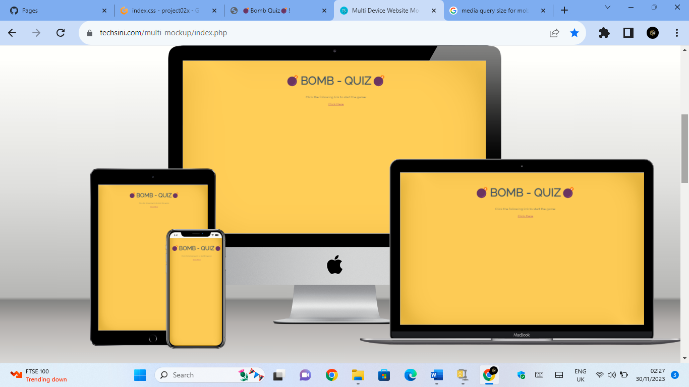
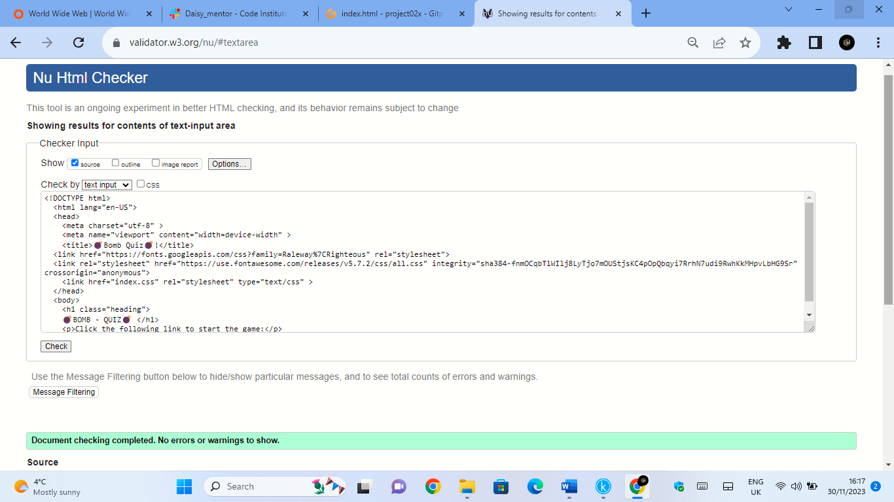
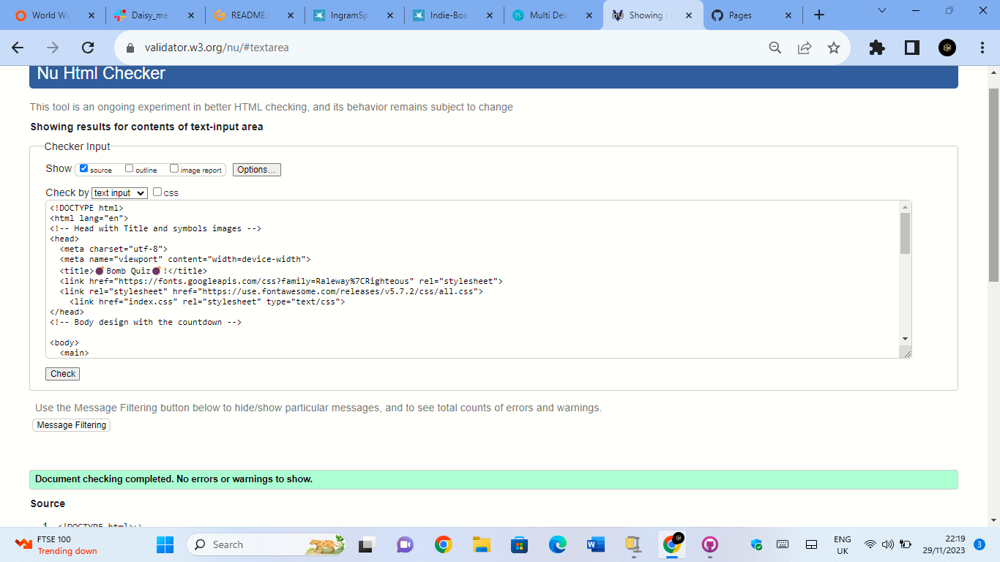
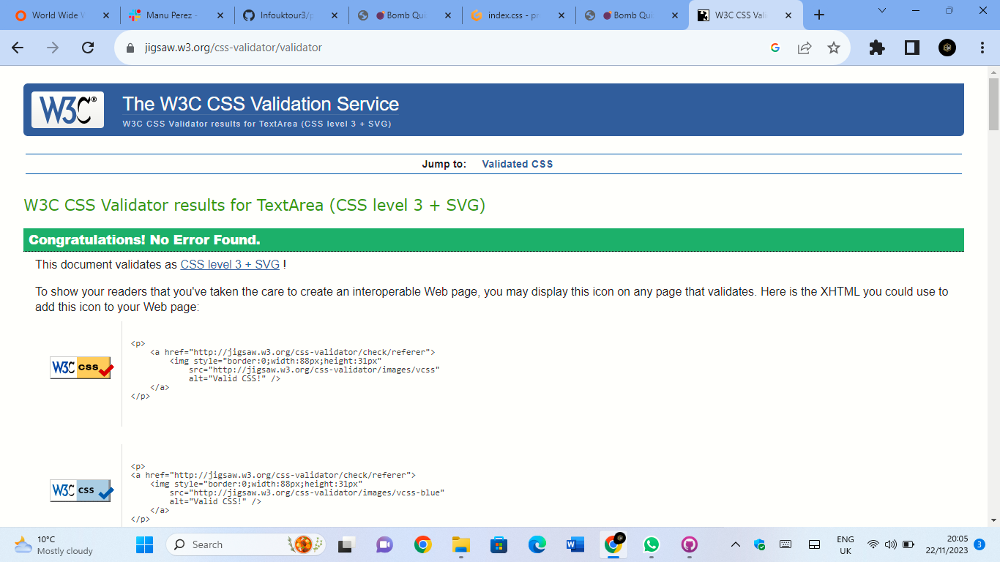
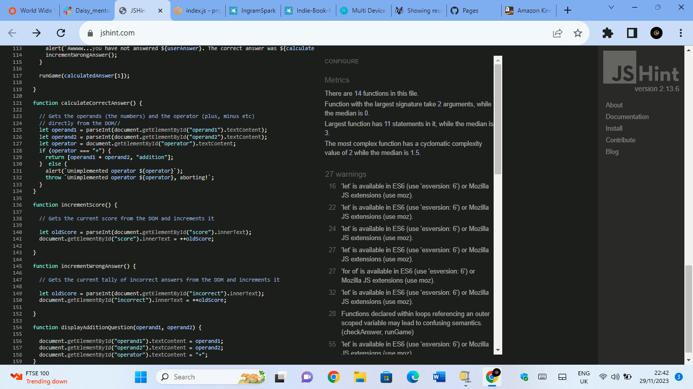

# BOMB QUIZ

[View the live project here.](https://infouktour3.github.io/project02x/)

This is the main Bomb Quiz website. It is designed to be responsibe on a range of devices, making it easy and intuitive to understand the use of the game for the reader and visitors.

## User Experience (UX)

### User stories
Looked into Balsamiq to have an idea and after I have carried on the prject with word file converted in pjg image/
[image](assets/images/Wireframe.png)[docs](docs/WIREFRAME-WEBSITE.docx)

#### First Time Visitor Goals
1) The website is made in a very clear and easy way to understand the game with a great background colour to show the other function of the game in a fast and intuitive way
2) The User will be able to easily explore the page and read the number result at the botton answers marked to play the game throughout the site. 
3) The visitor can decide when to start to play and when restart a game again just pressing the uperlink words.

##### Returning Visitor Goals
1) Returning Visitor wants to find a good game to be entertained something that keep their attention and excitment high which in return the site is made to enjoy the final user.
2) Returning Visitor like to see something simple and understand the game at the first glance, 
they do not want to be bored on understanding how work the game otherwise they will give up and it helps the visitor to return again.
3) The game is made with a great graphic and good contrast colour help to enjoy the user moment at the same time to make retun them.

#### Frequent User Goals / design colour scheme
1) The user want something fun and colourful with some images that help to get to know the game without reading long information.
2) The predominate colour is a dark yellow background colour with a great contrast with the title colour and the bottoms indication in which passing the cursor on make it change the colour 
 with a great effect and intuition that the bottom which is clickable.
3) In turn make the site more attractive expacially with fonts images showed on the screen.
 
#### Typography
The font used on the website is a Raleway - Sans Serif  as it is one of the most common font used today the font is cleaned is shows good read letters for all readers, 
even when the web site is used with different devices.

#### Imagery
The first image is posted just straight at the top of the page close to the title name of the game to catch the visitors attention and to transmit user attention. I have added othe emojis on the second pages and when the countdwon termines it shows other emojis to make understand the game is over.
[image](https://www.w3schools.com/charsets/tryit.asp?deci=128163)

#### Wireframes
-Home Page with Second Page once clicked Wireframe - [image](assets/images/Wireframe.png)

#### Features
The website has an actractive approach for the user, easy to understand and very intuitive with a good colour graphic and emojis to driver the visitor attention and clearly help to understand the game without that the user gets lost.

# Rule of the game
The game is a mathematical numerical play, where the user needs to answer the correct addition showed by random numbers intoa timeframe of 16 second, more the number are corrects and more increase the score, if the answer is wrong it will show on the incorect answer score [image](assets/images/rulegame.png)

# Game pages and explanation
In the first page contain the link interactive clickable to pass to a new  page where they can start to play, there is an hyperlink named "click here", so when the user click on the words phrase, it take to the user at the game page with more characteristic objects as bottoms, boxes and correct answer and inconrect one scored.
When the user is in the game page, the countdown start to beginning, there will be a limited time to answer the right questions, it starts with a 16 second and countdwon until reach zero, the user also is alert when is near to zero by  seeing the change red colour numbers around number 3 until zero. The game  page is also comprensive of interactive box and bottoms, the box is showed to insert the right answer in after the user decided that it could be a good answer, once the user insert his answer need to press the bottom submit to confirm his choice it will change the color when the curse is ove rthe bottom to help the user understand that it is clickable. If the answer is correct it will show underneath the bottom, the two textes written under the bottome give to them an indication if they have answered correctly, it shows the score answered, one correct and one incorrect in this case if the user aswer correctly will show a number scored on the right phrase, if he will spot on the correct answers more often the scores will increase, if it is incorect answer will go to the inconrect score the same, more are incorects and more the number will increase. Instead if the user no answer on time and the time will reach zero, he won't be able to answer anymore and the submit bottom will be disactivated, to restart the game again the user need to click the hyperlink where is written "Restart Game", automaticlly it will take the user at the first page of the game where will be ask again to clik the link to start the game.  
The website has also the features to be responsive on all device sizes and contain interactive elements like hyperlinks and bottoms where the user can use the game even on his mobile phone or tablet at his convenient.

### Technologies Used
Laptop

### Languages Used
HTML5
CSS3
JS

#### Frameworks, Libraries & Programs Used
1) [Bootstrap v5.3](https://getbootstrap.com/)
Bootstrap has been visited to assist me with the idea to create a responsiveness webssite and it help me to create a design inside a word file. [view](docs/WIREFRAME-WEBSITE.docx)
[Frameworks](https://infouktour3-project02x-w7gubda7n57.ws-eu106.gitpod.io/)

2) [Hover.css:] [view](index.css) [view](https://github.com/)
Hover css was used for the bottom and hyperlink writing, where have be added on the game page to be visible their function and helping to drive the user on using properly the game.

3) [W3Schools:](https://www.w3schools.com/charsets/tryit.asp?deci=128163)
W3Schools was used on the first and second page of the site to decorate the Title and make it intuitive for the game ahead plus on the time run out, the small image will be showed to the user, the emojis help also the aesthetic of the site and UX purposes.

4) [Git](https://infouktour3-project02x-yru3ukoln2m.ws-eu106.gitpod.io/)
GitHub has been used to store the projects code, after being added and pushed from Gitpod and workspace. Plus to cloen and deploy my project.

5) [Balsamiq:](https://balsamiq.com/)
Balsamiq was visited to gather some idea on starting the design process even if I used my imagination at the end and created it with a word file and coverted in pjg.

6)  [jQuery:](https://getbootstrap.com/docs/4.5/getting-started/introduction/)[jQuery](https://learn.codeinstitute.net/courses/course-v1:CodeInstitute+CSE101+2020_Q2/courseware/be0e510a3aca4bccb6e0bba4cf7cf06b/b47eaee24847486eb4424dfa29890cc0/).
jQuery find some information in bootstrap and in code istitue on use to have a responsive website for different devices. I have also used different source like youtube and W3school sites [view](https://www.w3schools.com/) to improve the responsiveness of the website.

### Testing
I have tested the website on W3C Markup Validator, W3C CSS Validator  and JS Validator, the services were used to validate every page of html, css and js. It helps to avoid any syntax errors. A lot of range of testing was done to ensure that all pages were linking correctly.The website has been deployed also trough GitHub for futher testiung. I tested also in Techsini to see a proper responsive designs for alld devices.

 

 
 
 

 
 
 [Multi Device Website Mockup Generator](assets/images/mokup.png)
 [Multi Device Website Mockup Generator](assets/images/mokup1.png)

The website was viewed on a variety of devices such as Desktop, Laptop, iPhone7, iPhone 8 & iPhoneX.
A large amount of testing was done to ensure that all pages were linking correctly on Techsini website [view](https://techsini.com/multi-mockup/index.php).
Friends and family members were asked to review the site and documentation to point out any bugs and/or user experience issues.

### Deploying
The website has be deployed on git hub pages by complete the following steps:

Go to the main repository
Click setting
Click the page tab on the left list
Under branch select main
Click save The website is now live and can be found here [view](https://infouktour3.github.io/project02x/)

### Clone
The website has been cloned in the GitHub platform from project02x to Bomb Quiz, following this steps:

Git-Hub home-page
Go Repositories main page
At the top left side click on <>Code
Click Local
Copy repository
Open Git-Bash
Changed the current working directory to the location where you want the cloned directory.
Typed git clone, and then paste the URL you copied [view](https://github.com/Infouktour3/project02x.git). git clone https://github.com/Infouktour3/project02x
press enter. Cloning into 

... remote: Enumerating objects: 160, done. 
remote: Counting objects: 100% (160/160), done.
remote: Compressing objects: 100% (109/109), done. 
remove: Total 160 (delta 81), reused 121 (delta 43),pack-reused 0
Receiving objects: 100% (160/160), 1.86 MiB | 20.25 MiB/s, done.
Resolving deltas: 100% (81/81), done. (to check)

### Code
html, css and js codes were written through github [view](https://infouktour3-project02x-w7gubda7n57.ws-eu106.gitpod.io/) workspace and repositories.

### Content
All content was written by myself.

#### Media/Images
I Used few emojis to add at the title and on the countdown row line when the time will be termined it will show, to make more ahestetic the design [view](https://www.w3schools.com/html/html_emojis.asp), the style and the colour of the pages insted has been created with css code. 

#### Acknowledgements
To the tutor support at Code Institute, Mentor and Slack mates.
